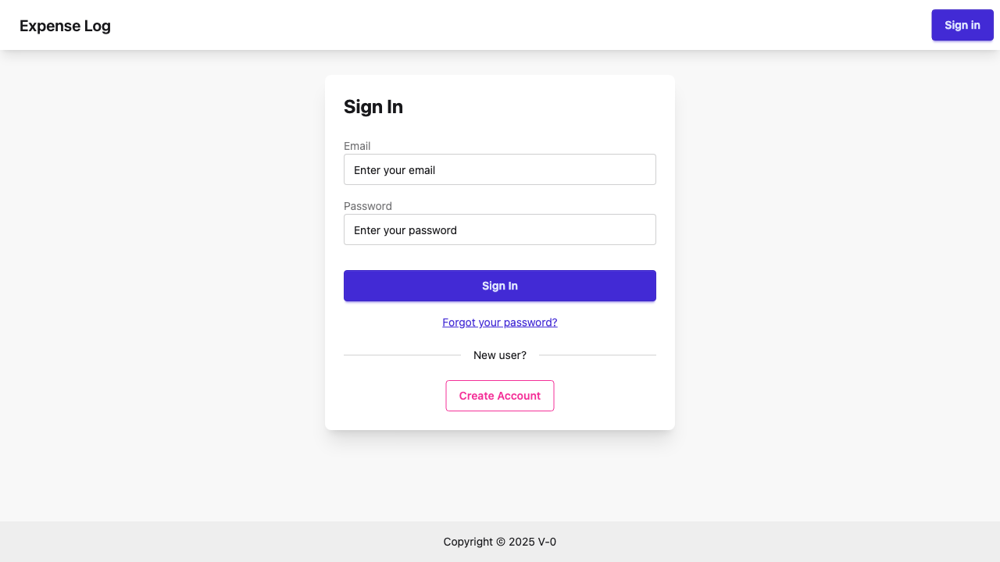

# Creating an Expense

_2026-03-29T02:54:58Z by Showboat 0.6.1_

<!-- showboat-id: dbe10f18-bacd-480b-af83-66d34f2a0bb2 -->

The Expense Log app requires users to be signed in before they can access the expenses page. Let's start by navigating to the sign-in page.

```bash
uvx rodney open http://localhost:3000/auth/sign-in
```

```output
Expense Log
```

```bash
uvx rodney wait "[data-testid='email-input']" && uvx rodney screenshot Notes/walkthroughs/sign-in-page.png && echo done
```

```output
Element visible
Notes/walkthroughs/sign-in-page.png
done
```

```bash {image}

```



Enter your email and password to sign in, then submit the form.
